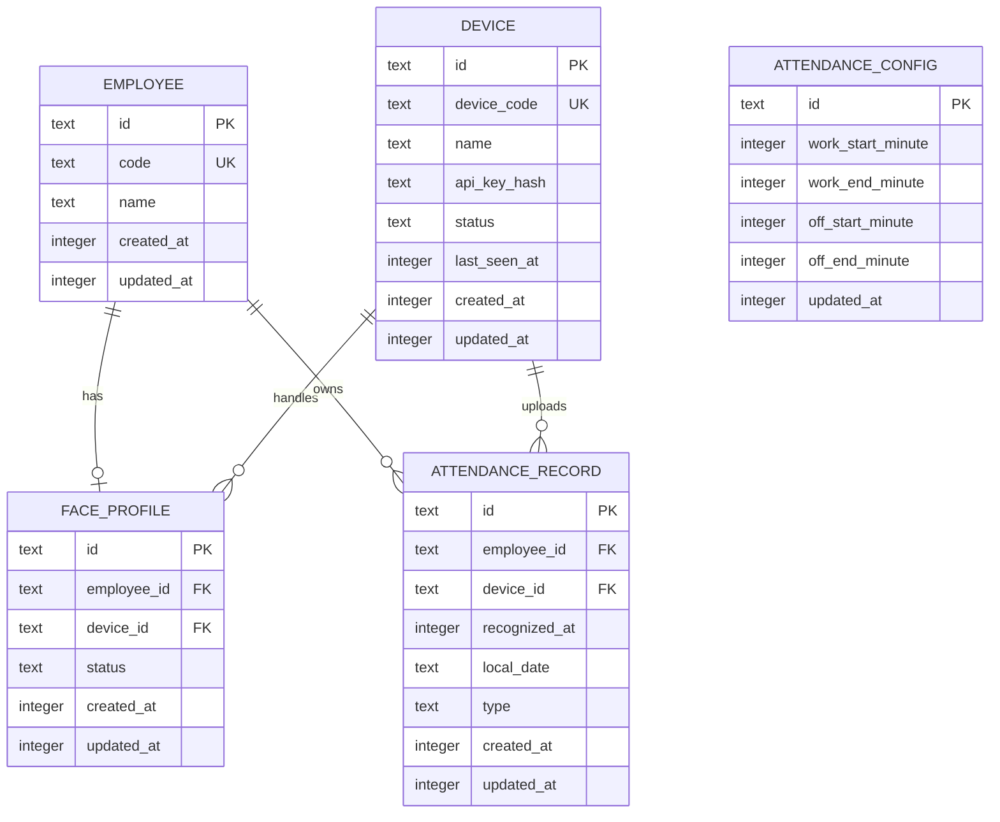

# 考勤系统数据库设计

## 概述

本文档给出当前毕设 MVP 考勤系统的最终数据库表设计。

说明：

- 当前系统采用单组织、单服务架构
- 数据库存储固定使用 SQLite
- 当前仓库已存在 Better Auth 相关认证表
- 本文档重点描述业务相关表
- 管理员登录继续使用现有认证表
- 设备识别成功后直接上传 `employeeId`
- 服务端不保存人脸特征和图片
- 设备端模板库存储不属于服务端数据库范围，由设备本地持久化方案负责
- 当前 MVP 默认使用中国时间，不额外存储时区信息
- 当前答辩演示按单管理员、单设备场景实现

## 现有认证表

当前仓库中已存在以下认证相关表：

- `user`
- `session`
- `account`
- `verification`

这些表只用于后台管理员登录，不直接参与考勤业务流程。

## 业务表总览

本系统新增 5 张业务表：

1. `employee`
2. `device`
3. `attendance_config`
4. `face_profile`
5. `attendance_record`

补充说明：

- 当前 MVP 不额外建立 `employee-device` 绑定表
- 设备本地保存员工信息、考勤配置、录脸任务和失败日志，这些内容不进入服务端数据库
- 设备端人脸模板库主存储位于设备本地 `SD Card`，不进入服务端数据库

---

## 1. employee

用途：保存被考勤人员信息。

| 字段名       | 类型      | 约束       | 说明                 |
| ------------ | --------- | ---------- | -------------------- |
| `id`         | `text`    | 主键       | 随机字符串 ID        |
| `code`       | `text`    | 非空，唯一 | 员工编号、学号或工号 |
| `name`       | `text`    | 非空       | 员工姓名             |
| `created_at` | `integer` | 非空       | 毫秒时间戳           |
| `updated_at` | `integer` | 非空       | 毫秒时间戳           |

业务约束：

- `code` 必须全局唯一

---

## 2. device

用途：保存设备注册信息和设备鉴权信息。

| 字段名         | 类型      | 约束                | 说明                     |
| -------------- | --------- | ------------------- | ------------------------ |
| `id`           | `text`    | 主键                | 随机字符串 ID            |
| `device_code`  | `text`    | 非空，唯一          | 后端自动生成的设备码     |
| `name`         | `text`    | 非空                | 设备名称                 |
| `api_key_hash` | `text`    | 非空                | 设备密钥哈希             |
| `status`       | `text`    | 非空，默认 `active` | `active` 或 `disabled`   |
| `last_seen_at` | `integer` | 可空                | 最近在线时间，毫秒时间戳 |
| `created_at`   | `integer` | 非空                | 毫秒时间戳               |
| `updated_at`   | `integer` | 非空                | 毫秒时间戳               |

业务约束：

- `device_code` 必须唯一
- 数据库不保存明文 `apiKey`
- 设备禁用后不能继续同步和上传
- `apiKey` 仅在创建设备时生成一次
- MVP 阶段不支持 `apiKey` 重置或轮换

---

## 3. attendance_config

用途：保存全局唯一的一套考勤时间段配置。

| 字段名              | 类型      | 约束 | 说明               |
| ------------------- | --------- | ---- | ------------------ |
| `id`                | `text`    | 主键 | 随机字符串 ID      |
| `work_start_minute` | `integer` | 非空 | 上班打卡开始分钟数 |
| `work_end_minute`   | `integer` | 非空 | 上班打卡结束分钟数 |
| `off_start_minute`  | `integer` | 非空 | 下班打卡开始分钟数 |
| `off_end_minute`    | `integer` | 非空 | 下班打卡结束分钟数 |
| `updated_at`        | `integer` | 非空 | 毫秒时间戳         |

分钟数示例：

- `09:00` 对应 `540`
- `10:00` 对应 `600`
- `18:00` 对应 `1080`

业务约束：

- 全系统只允许存在一条配置记录
- 后端不写默认时间
- 前端负责提供默认表单值
- 时区固定为 `Asia/Shanghai`
- 推荐使用固定主键保存单例配置，例如 `id = 'default'`
- 所有分钟值都应落在 `0-1439`
- 需满足：
  - `work_start_minute < work_end_minute`
  - `off_start_minute < off_end_minute`
  - 两个时间段不得重叠
  - 两个时间段不得相互包含
  - 时间段不得跨天
- 设备端与服务端统一按 `[start, end)` 判定时间段

---

## 4. face_profile

用途：同时承担录脸任务和录脸结果状态表。

| 字段名        | 类型      | 约束                 | 说明                                        |
| ------------- | --------- | -------------------- | ------------------------------------------- |
| `id`          | `text`    | 主键                 | 随机字符串 ID，也可作为录脸任务 ID          |
| `employee_id` | `text`    | 非空，唯一，外键     | 关联员工                                    |
| `device_id`   | `text`    | 非空，外键           | 分配录脸的设备                              |
| `status`      | `text`    | 非空，默认 `pending` | `pending`、`success`、`failed`、`cancelled` |
| `created_at`  | `integer` | 非空                 | 毫秒时间戳                                  |
| `updated_at`  | `integer` | 非空                 | 毫秒时间戳                                  |

业务约束：

- 一个员工只保留一条当前录脸记录
- 重新录脸时覆盖该员工原记录
- 同一台设备同一时刻只能有一个 `pending` 任务
- 设备录脸成功后，状态更新为 `success`
- 管理员可将 `pending` 任务取消为 `cancelled`
- 设备若对已取消任务继续上报结果，服务端忽略该结果并返回 `TASK_CANCELLED`
- 后续识别直接上传 `employeeId`，因此此表不保存 `deviceFaceId`

建议索引：

- 唯一索引：`employee_id`
- 普通索引：`device_id`
- 条件唯一索引：`device_id` 在 `status = 'pending'` 时唯一

---

## 5. attendance_record

用途：保存最终有效考勤记录。

说明：

- 当前 MVP 只保存有效记录
- 无效记录和重复记录不单独入库

| 字段名          | 类型      | 约束       | 说明                        |
| --------------- | --------- | ---------- | --------------------------- |
| `id`            | `text`    | 主键       | 随机字符串 ID               |
| `employee_id`   | `text`    | 非空，外键 | 关联员工                    |
| `device_id`     | `text`    | 非空，外键 | 关联设备                    |
| `recognized_at` | `integer` | 非空       | 实际识别时间，毫秒时间戳    |
| `local_date`    | `text`    | 非空       | 本地日期，格式 `YYYY-MM-DD` |
| `type`          | `text`    | 非空       | `clock_in` 或 `clock_out`   |
| `created_at`    | `integer` | 非空       | 创建时间，毫秒时间戳        |
| `updated_at`    | `integer` | 非空       | 更新时间，毫秒时间戳        |

业务约束：

- 同一员工同一天同一类型只保留一条
- 如果后上传的同类记录时间更早，则更新为更早的 `recognized_at`
- `local_date` 按 `Asia/Shanghai` 从 `recognized_at` 计算得出
- 当前 MVP 不额外校验员工与设备的绑定关系，只校验设备身份合法且员工存在
- 服务端拒绝写入的记录不入库，拒绝原因通过接口返回给设备本地记录

建议索引：

- 唯一索引：`employee_id + local_date + type`
- 普通索引：`local_date + type`
- 普通索引：`device_id + local_date`

---

## 表关系说明

### employee 与 face_profile

- 一个员工最多对应一条当前录脸记录
- 一个录脸记录必须属于一个员工

关系：

- `employee 1 -> 0..1 face_profile`

### device 与 face_profile

- 一条录脸记录由一台设备处理
- 一台设备可以处理多个员工的录脸记录

关系：

- `device 1 -> n face_profile`

### employee 与 attendance_record

- 一个员工可以有多条考勤记录
- 一条考勤记录只属于一个员工

关系：

- `employee 1 -> n attendance_record`

### device 与 attendance_record

- 一台设备可以上传多条考勤记录
- 一条考勤记录来自一台设备

关系：

- `device 1 -> n attendance_record`

### attendance_config

- 为全局单例配置表
- 不与其他表建立外键
- 推荐通过固定主键记录和 upsert 语义保证全局只存在一条

---

## 数据库关系图

---

## 字段类型建议

结合当前仓库现有 Drizzle 风格，建议如下：

- 主键使用 `text`
- 状态和类型字段使用 `text`
- 时间字段使用 `integer(..., { mode: "timestamp_ms" })`
- `local_date` 使用 `text`

推荐的状态枚举：

- `device.status`
  - `active`
  - `disabled`
- `face_profile.status`
  - `pending`
  - `success`
  - `failed`
  - `cancelled`
- `attendance_record.type`
  - `clock_in`
  - `clock_out`

## 总结

当前数据库设计遵循两个原则：

1. 只保留实现毕设 MVP 必需的数据结构
2. 尽量让设备端和服务端职责清晰

最终结果是：

- 后台只负责管理和查询
- 设备只负责识别和上传
- 数据库只保留真正需要的业务数据
- 部署形态固定为单组织单服务，数据库固定为 SQLite
